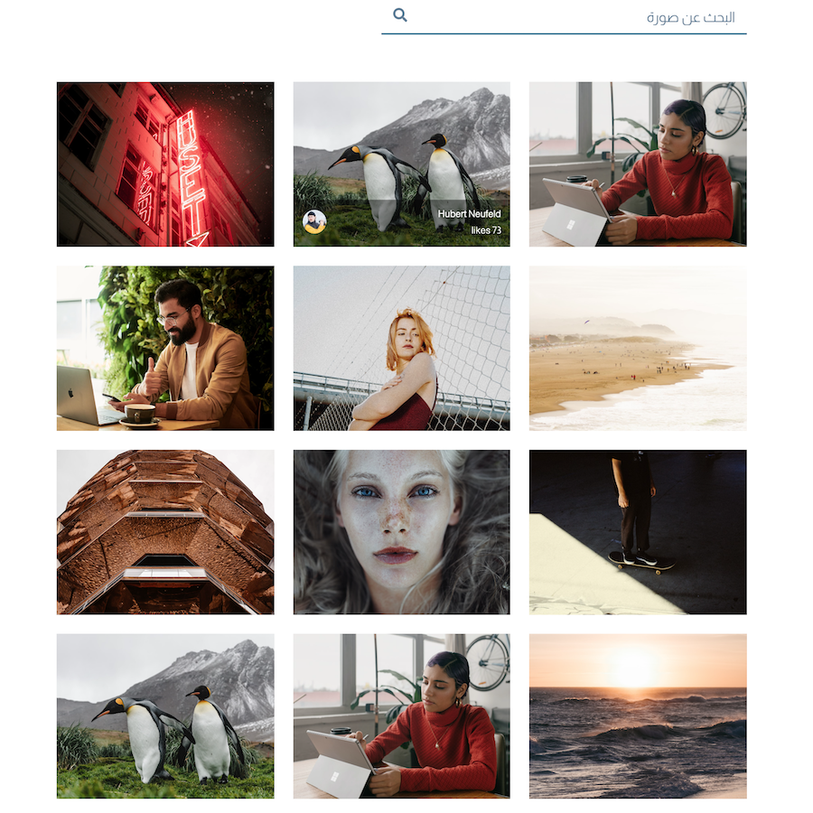

# Getting Started with unsplash photo search App
# البدء ببرنامج البحث عن الصور

#### صورة من البرنامج 
#### Screenshot

## Available Scripts
## الاكواد للتشغيل

### clone the files
### انسخ الملفات لجهازك

`git clone https://github.com/abdulaziz003/menu-app.git`

In the project directory, you can run:
في مجلد المشرع تستطيع استخدام الاوامر التالية:

### `npm install`

to install all node package
تثبيت كل المتطلبات قبل تشغيل البرنامج

### `npm start`

Runs the app in the development mode.\
سيعمل التطبيق في بيئة تطويرية ويمكنك فتح التطبيق
Open [http://localhost:3000](http://localhost:3000) to view it in the browser. لمشاهدة التطبيق

The page will reload if you make edits.\
You will also see any lint errors in the console.

استمتع ... 😊
